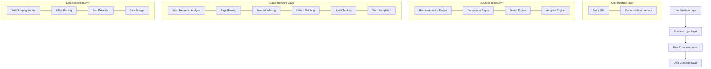
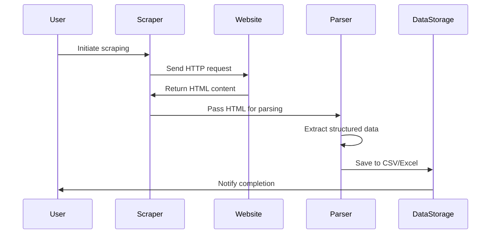
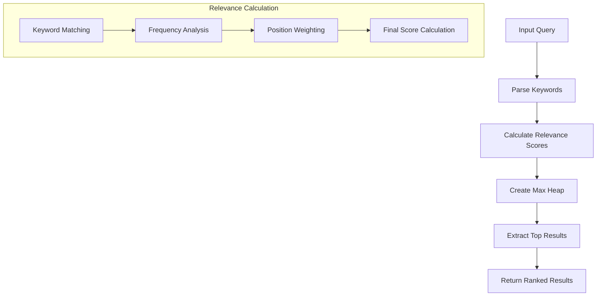
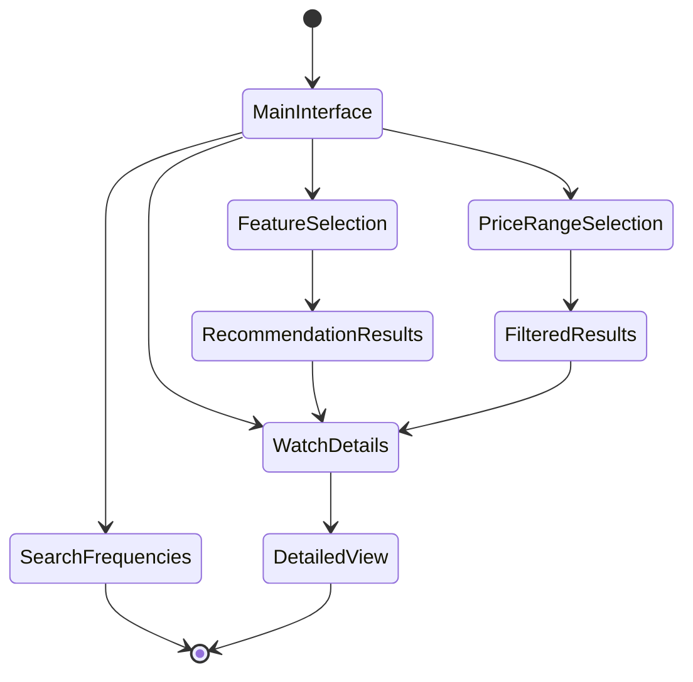
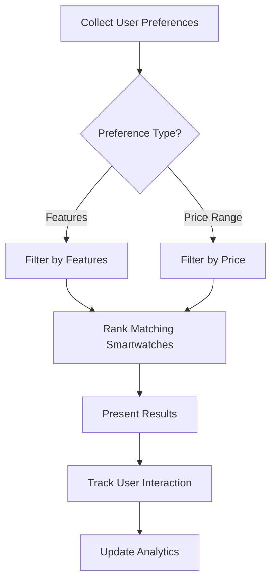
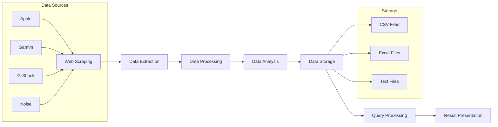
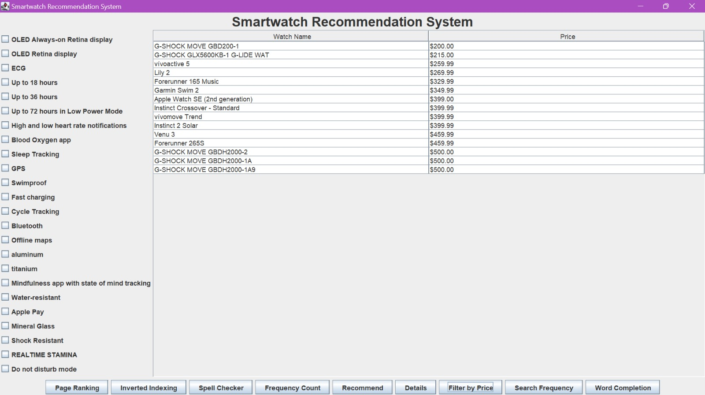
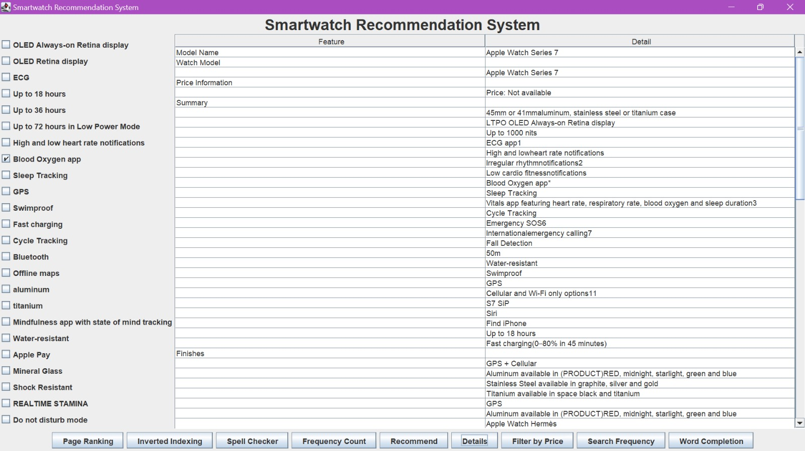

# TickFit - Smartwatch Recommendation and Comparison System

<div align="center">
 
  <br/>
  <h3>A comprehensive platform for smartwatch data analysis, comparison, and recommendations</h3>
  <p>Advanced web scraping, natural language processing, and data visualization for smartwatch enthusiasts</p>
</div>


## 📋 Table of Contents

- [Overview](#-overview)
- [Key Features](#-key-features)
- [System Architecture](#-system-architecture)
- [Technology Stack](#-technology-stack)
- [Core Modules](#-core-modules)
  - [Web Scraping Module](#web-scraping-module)
  - [Data Analysis Module](#data-analysis-module)
  - [User Interface Module](#user-interface-module)
  - [Search & Recommendation Module](#search--recommendation-module)
  - [NLP & Text Processing Module](#nlp--text-processing-module)
- [Data Flow & Processing](#-data-flow--processing)
- [Setup & Installation](#-setup--installation)
- [Usage Guide](#-usage-guide)
- [Advanced Features](#-advanced-features)
- [Algorithms & Data Structures](#-algorithms--data-structures)
- [Performance Optimizations](#-performance-optimizations)
- [Future Enhancements](#-future-enhancements)
- [Contributing](#-contributing)
- [License](#-license)

## 🔍 Overview

TickFit is an advanced Java-based application that provides comprehensive smartwatch data analytics, comparison, and personalized recommendations. The system scrapes real-time data from multiple smartwatch manufacturers (Apple, Garmin, G-Shock, Noise), processes the information using sophisticated algorithms, and presents users with detailed comparisons and recommendations based on their preferences.

The platform combines web scraping, data processing, information retrieval techniques, and a user-friendly interface to help users make informed decisions when purchasing smartwatches. Whether you're looking for specific features, price ranges, or detailed technical specifications, TickFit provides a one-stop solution for all smartwatch-related needs.

## ✨ Key Features

- **Multi-Brand Data Collection**: Scrapes and analyzes data from Apple, Garmin, G-Shock, and Noise smartwatches
- **Feature-Based Recommendations**: Recommends smartwatches based on user-selected features and requirements
- **Price-Based Filtering**: Filters smartwatches by different price ranges
- **Detailed Comparisons**: Provides side-by-side comparisons of smartwatch specifications and features
- **Search Analytics**: Tracks and analyzes user search patterns and frequencies
- **Natural Language Processing**: Implements spell checking, word completion, and search suggestions
- **Information Retrieval Techniques**: Utilizes page ranking and inverted indexing for efficient data retrieval
- **Interactive User Interface**: Offers both command-line and graphical user interfaces
- **Real-Time Data**: Fetches the most up-to-date information directly from manufacturer websites

## 🏗 System Architecture




```mermaid
flowchart TB
    %% Platforms Boundary
    subgraph "Platforms Boundary" 
        direction TB
        Android["Android"]:::external
        iOS["iOS"]:::external
        Web["Web"]:::external
        Linux["Linux"]:::external
        macOS["macOS"]:::external
        Windows["Windows"]:::external
    end

    Android -->|hosts| FlutterApp
    iOS -->|hosts| FlutterApp
    Web -->|hosts| FlutterApp
    Linux -->|hosts| FlutterApp
    macOS -->|hosts| FlutterApp
    Windows -->|hosts| FlutterApp

    FlutterApp["Flutter App"]:::ui

    %% UI Layer
    subgraph "UI Layer" 
        direction TB
        AuthScreens["Auth Screens"]:::ui
        CommunityScreens["Community Screens"]:::ui
        FeedScreen["Feed Screen"]:::ui
        PostScreens["Post Screens"]:::ui
        UserProfileScreens["User Profile Screens"]:::ui
        HomeScreens["Home Screen & Drawers"]:::ui
        CoreWidgets["Core Widgets"]:::ui
        Responsive["Responsive Utility"]:::ui
        ThemeUtil["Theme Utility"]:::ui
        Router["Routing (Routemaster)"]:::ui
    end

    FlutterApp -->|"renders"| AuthScreens
    FlutterApp -->|"renders"| CommunityScreens
    FlutterApp -->|"renders"| FeedScreen
    FlutterApp -->|"renders"| PostScreens
    FlutterApp -->|"renders"| UserProfileScreens
    FlutterApp -->|"renders"| HomeScreens
    FlutterApp -->|"uses"| CoreWidgets
    FlutterApp -->|"uses"| Responsive
    FlutterApp -->|"uses"| ThemeUtil
    FlutterApp -->|"uses"| Router

    %% Business Layer
    subgraph "Business Layer" 
        direction TB
        AuthController["AuthController"]:::business
        CommunityController["CommunityController"]:::business
        PostController["PostController"]:::business
        UserProfileController["UserProfileController"]:::business
        ThemeNotifier["ThemeNotifier"]:::business
    end

    AuthScreens -->|calls| AuthController
    CommunityScreens -->|calls| CommunityController
    FeedScreen -->|calls| PostController
    PostScreens -->|calls| PostController
    UserProfileScreens -->|calls| UserProfileController
    HomeScreens -->|calls| ThemeNotifier

    %% Data Layer
    subgraph "Data Layer"
        direction TB
        AuthRepo["AuthRepository"]:::data
        CommunityRepo["CommunityRepository"]:::data
        PostRepo["PostRepository"]:::data
        UserProfileRepo["UserProfileRepository"]:::data
        StorageRepo["StorageRepository"]:::data
    end

    AuthController -->|uses| AuthRepo
    CommunityController -->|uses| CommunityRepo
    PostController -->|uses| PostRepo
    UserProfileController -->|uses| UserProfileRepo
    PostController -->|uploads images to| StorageRepo

    %% Firebase Layer
    subgraph "Firebase Layer"
        direction TB
        FirebaseAuth["FirebaseAuth"]:::firebase
        FirestoreSDK["FirebaseFirestore"]:::firebase
        StorageSDK["FirebaseStorage"]:::firebase
        FireOptions["firebase_options.dart"]:::firebase
        FirebaseConsts["Firebase Constants"]:::firebase
        GoogleSignIn["Google Sign-In"]:::external
    end

    AuthRepo -->|auth calls| FirebaseAuth
    AuthRepo -->|oauth| GoogleSignIn
    AuthRepo -->|reads/writes| FirestoreSDK
    CommunityRepo -->|CRUD| FirestoreSDK
    PostRepo -->|CRUD| FirestoreSDK
    UserProfileRepo -->|CRUD| FirestoreSDK
    StorageRepo -->|uploads/downloads| StorageSDK

    FireOptions -->|configures| FirebaseAuth
    FireOptions -->|configures| FirestoreSDK
    FireOptions -->|configures| StorageSDK
    FirebaseConsts -->|defines collections| FirestoreSDK

    FirestoreSDK -->|streams| PostController
    FirestoreSDK -->|streams| CommunityController
    FirestoreSDK -->|streams| UserProfileController

    %% External Hosting
    subgraph "External Services"
        FirebaseHosting["Firebase Hosting / Vercel"]:::external
    end
    Web -->|deployed on| FirebaseHosting

    %% Click Events
    click AuthScreens "https://github.com/arshnoor-singh-sohi/reddit/blob/main/lib/features/auth/screens/login_screen.dart"
    click CommunityScreens "https://github.com/arshnoor-singh-sohi/reddit/tree/main/lib/features/community/screens/"
    click FeedScreen "https://github.com/arshnoor-singh-sohi/reddit/blob/main/lib/features/feed/feed_screen.dart"
    click PostScreens "https://github.com/arshnoor-singh-sohi/reddit/tree/main/lib/features/post/screens/"
    click UserProfileScreens "https://github.com/arshnoor-singh-sohi/reddit/tree/main/lib/features/user_profile/screens/"
    click HomeScreens "https://github.com/arshnoor-singh-sohi/reddit/blob/main/lib/features/home/screens/home_screen.dart"
    click HomeScreens "https://github.com/arshnoor-singh-sohi/reddit/tree/main/lib/features/home/drawers/"
    click CoreWidgets "https://github.com/arshnoor-singh-sohi/reddit/blob/main/lib/core/common/post_card.dart"
    click CoreWidgets "https://github.com/arshnoor-singh-sohi/reddit/blob/main/lib/core/common/loader.dart"
    click CoreWidgets "https://github.com/arshnoor-singh-sohi/reddit/blob/main/lib/core/common/sign_in_button.dart"
    click CoreWidgets "https://github.com/arshnoor-singh-sohi/reddit/blob/main/lib/core/common/error_text.dart"
    click Responsive "https://github.com/arshnoor-singh-sohi/reddit/blob/main/lib/responsive/responsive.dart"
    click ThemeUtil "https://github.com/arshnoor-singh-sohi/reddit/blob/main/lib/theme/pallete.dart"
    click Router "https://github.com/arshnoor-singh-sohi/reddit/blob/main/lib/router.dart"
    click AuthController "https://github.com/arshnoor-singh-sohi/reddit/blob/main/lib/features/auth/controller/auth_controller.dart"
    click CommunityController "https://github.com/arshnoor-singh-sohi/reddit/blob/main/lib/features/community/controller/community_controller.dart"
    click PostController "https://github.com/arshnoor-singh-sohi/reddit/blob/main/lib/features/post/controller/post_controller.dart"
    click UserProfileController "https://github.com/arshnoor-singh-sohi/reddit/blob/main/lib/features/user_profile/controller/user_profile_controller.dart"
    click AuthRepo "https://github.com/arshnoor-singh-sohi/reddit/blob/main/lib/features/auth/repository/auth_repository.dart"
    click CommunityRepo "https://github.com/arshnoor-singh-sohi/reddit/blob/main/lib/features/community/repository/community_repository.dart"
    click PostRepo "https://github.com/arshnoor-singh-sohi/reddit/blob/main/lib/features/post/respository/post_repository.dart"
    click UserProfileRepo "https://github.com/arshnoor-singh-sohi/reddit/blob/main/lib/features/user_profile/repository/user_profile_repository.dart"
    click StorageRepo "https://github.com/arshnoor-singh-sohi/reddit/blob/main/lib/core/providers/storage_repository_provider.dart"
    click FireOptions "https://github.com/arshnoor-singh-sohi/reddit/blob/main/lib/firebase_options.dart"
    click FirebaseConsts "https://github.com/arshnoor-singh-sohi/reddit/blob/main/lib/core/constants/firebase_constant.dart"
    click FirebaseAuth "https://github.com/arshnoor-singh-sohi/reddit/blob/main/lib/core/providers/firebase_providers.dart"

    %% Styles
    classDef ui fill:#D0E8FF,stroke:#0366D6,color:#0366D6
    classDef business fill:#E2F0D9,stroke:#1B7F4F,color:#1B7F4F
    classDef data fill:#FFE7C6,stroke:#D97700,color:#D97700
    classDef firebase fill:#F3E8FF,stroke:#7C3AED,color:#7C3AED
    classDef external fill:#EEEEEE,stroke:#999999,color:#333333
```

TickFit follows a modular architecture with clearly separated components that handle specific functionalities. The system is designed to be easily extensible and maintainable.



## 🛠 Technology Stack

| Component | Technologies |
|-----------|--------------|
| **Backend Core** | Java 8+, Selenium, JSoup |
| **Data Processing** | Apache POI, Custom Algorithms |
| **User Interface** | Swing, HTML/CSS/JavaScript |
| **Web Integration** | Spring Boot (for API endpoints) |
| **Testing** | JUnit |
| **Build Tools** | Maven |
| **Database** | File-based storage (Excel, CSV) |
| **IDE Used** | IntelliJ IDEA |

## 📦 Core Modules

### Web Scraping Module

The web scraping module is responsible for extracting smartwatch data from official websites. This module utilizes Selenium WebDriver for dynamic websites and JSoup for static HTML content.

#### Key Components

1. **AppleWatchScraper**: Scrapes Apple Watch data from the official comparison page
   - Extracts model details, prices, and features
   - Saves data to CSV and Excel formats
   - Supports comparison between different Apple Watch models

2. **UWCrawler**: Generic crawler for collecting web pages
   - Crawls websites starting from a seed URL
   - Limits the number of pages to avoid overloading servers
   - Saves HTML content to files for further processing

3. **HTMLParser**: Parses raw HTML content
   - Extracts structured data from HTML
   - Converts HTML to plain text for easier processing
   - Handles different smartwatch manufacturer websites

4. **HTMLtoTextConverter**: Converts HTML files to plain text
   - Processes saved HTML files
   - Extracts relevant text content
   - Provides clean data for further analysis

#### Data Extraction Process



#### Code Example: Extract Watch Details

```java
private void extractComparisonData() {
    // Obtain features and specifications
    WebDriverWait wait = new WebDriverWait(driver, Duration.ofSeconds(10));
    List<WebElement> allDivs = wait.until(ExpectedConditions.presenceOfAllElementsLocatedBy(
            By.cssSelector("div.compare-column.template-item-default[role='cell gridcell']")));

    StringBuilder data = new StringBuilder();
    int featureCount = 1;

    // Process each feature element
    for (WebElement div : allDivs) {
        String feature = div.getText().trim();
        // Skip empty features or placeholders
        if (!feature.isEmpty() && !feature.equals("—")) {
            data.append(String.format("%-20s | %-50s%n", 
                    "Feature " + featureCount, feature));
            featureCount++;
        }
    }
    // Save or process the extracted data
    return data.toString();
}
```

### Data Analysis Module

The data analysis module processes the collected data to extract meaningful insights and prepare it for user queries.

#### Key Components

1. **WordFrequencyAnalyzer**: Analyzes word frequencies in collected data
   - Identifies most common terms and features
   - Builds frequency maps for search optimization
   - Supports multiple analysis strategies

2. **PageRankingGUI**: Implements page ranking algorithms
   - Ranks smartwatch models based on relevance to keywords
   - Uses custom algorithms for sorting and ranking
   - Provides a GUI interface for ranking visualization

3. **InvertedIndex**: Creates an inverted index for efficient text search
   - Maps words to their document occurrences
   - Implements a Trie data structure for efficient storage
   - Optimizes search speed for word lookups

#### Word Frequency Analysis Process

This module uses a combination of data structures and algorithms to efficiently analyze text:

- **TreeMap** for sorted frequency storage
- **PriorityQueue** for efficient ranking
- **Custom tokenization** for text processing
- **Stopword filtering** to remove common words

#### Page Ranking Algorithm



#### Code Example: Page Ranking Logic

```java
public static List<Map.Entry<String, Integer>> rankPages(File directory, 
        List<String> searchKeywords) throws IOException {
    File[] files = directory.listFiles();
    PriorityQueue<Map.Entry<String, Integer>> maxHeap = new PriorityQueue<>(
            (a, b) -> b.getValue() - a.getValue()
    );

    if (files != null) {
        for (File file : files) {
            if (file.isFile()) {
                Map<String, Integer> frequencyMap = parsePage(file);
                int rank = calculatePageRank(frequencyMap, searchKeywords);
                maxHeap.offer(new AbstractMap.SimpleEntry<>(file.getName(), rank));
            }
        }
    }

    List<Map.Entry<String, Integer>> rankedPages = new ArrayList<>();
    while (!maxHeap.isEmpty()) {
        rankedPages.add(maxHeap.poll());
    }
    return rankedPages;
}
```

### User Interface Module

TickFit provides both command-line and graphical user interfaces to accommodate different user preferences.

#### Key Components

1. **SmartwatchRecommendationUI**: Main Swing-based user interface
   - Feature selection interface
   - Recommendation display
   - Watch detail viewing
   - Search frequency tracking

2. **Task1SwingUI**: Specialized UI for Apple Watch comparison
   - Real-time search with autocomplete
   - Detailed comparison view
   - Search frequency analytics
   - Interactive results display

3. **RegexHighlighterApp**: Text pattern highlighting tool
   - Highlights patterns in text documents
   - Supports multiple pattern types
   - Color-coded visualization

#### User Interface Flow



#### UI Layout and Components

The main UI is divided into several key components:

- **Feature Selection Panel**: Checkboxes for selecting desired smartwatch features
- **Results Panel**: Table view showing matching smartwatches
- **Detail View**: Detailed information about selected smartwatch
- **Search Panel**: Text field with autocomplete for searching specific models
- **Analytics Panel**: Visualization of search frequencies and patterns

### Search & Recommendation Module

This module handles the core functionality of recommending smartwatches based on user preferences and search patterns.

#### Key Components

1. **SmartwatchRecommendationSystem**: Core recommendation engine
   - Feature-based recommendations
   - Price-based filtering
   - Detailed watch information retrieval
   - Search frequency tracking

2. **AppleWatchComparator**: Apple Watch comparison tool
   - Side-by-side comparison of Apple Watch models
   - Feature and price comparisons
   - Excel output for detailed comparisons

3. **FrequencyCounter**: Tracks and analyzes search patterns
   - Monitors word and search frequencies
   - Builds user behavior profiles
   - Improves recommendation relevance

#### Recommendation Process

The recommendation process follows these steps:

1. Collect user preferences (features or price range)
2. Filter smartwatches based on selected criteria
3. Rank matching smartwatches by relevance
4. Present results to the user
5. Track user interactions for analytics



#### Code Example: Smartwatch Recommendation

```java
public void recommendSmartwatch(Set<String> selectedFeatures) {
    List<String> recommendations = new ArrayList<>();

    // Check each workbook (brand) for matching watches
    recommendations.addAll(checkWorkbook(appleWorkbook, selectedFeatures));
    recommendations.addAll(checkWorkbook(gshockWorkbook, selectedFeatures));
    recommendations.addAll(checkWorkbook(garminWorkbook, selectedFeatures));
    recommendations.addAll(checkWorkbook(noiseWorkbook, selectedFeatures));

    // Display recommendations
    if (!recommendations.isEmpty()) {
        System.out.println("Recommended Models:");
        for (String model : recommendations) {
            System.out.println("- " + model);
        }
    } else {
        System.out.println("No matching smartwatches found.");
    }
}
```

### NLP & Text Processing Module

This module implements natural language processing and text processing features to enhance user experience.

#### Key Components

1. **SpellChecker**: Provides spelling suggestions
   - Uses edit distance algorithm
   - Suggests corrections for misspelled watch names
   - Improves search accuracy

2. **WordCompletionNew**: Implements word autocompletion
   - Uses AVL tree data structure for efficient prefix search
   - Suggests completions based on user input
   - Improves search efficiency

3. **RegexValidator**: Validates and extracts patterns from text
   - Identifies URLs, email addresses, phone numbers
   - Extracts structured data from unstructured text
   - Enhances data extraction capabilities

#### Spell Checking Algorithm

The spell checker uses the Levenshtein distance algorithm to find words similar to a misspelled input:

```java
public static int calculateEditDistance(String word1, String word2) {
    int len1 = word1.length();
    int len2 = word2.length();
    int[][] dp = new int[len1 + 1][len2 + 1];

    for (int i = 0; i <= len1; i++) {
        for (int j = 0; j <= len2; j++) {
            if (i == 0) dp[i][j] = j; // If first string is empty
            else if (j == 0) dp[i][j] = i; // If second string is empty
            else if (word1.charAt(i - 1) == word2.charAt(j - 1)) {
                dp[i][j] = dp[i - 1][j - 1]; // Characters match
            } else {
                dp[i][j] = 1 + Math.min(dp[i - 1][j], 
                                      Math.min(dp[i][j - 1], 
                                             dp[i - 1][j - 1])); // Insert, delete, replace
            }
        }
    }
    return dp[len1][len2];
}
```

## 🔄 Data Flow & Processing

The TickFit system follows a comprehensive data flow pipeline from collection to presentation:



### Data Processing Pipeline

1. **Collection**: Web scrapers collect raw HTML data from smartwatch websites
2. **Extraction**: Parsers extract structured data from HTML content
3. **Transformation**: Data is processed, cleaned, and normalized
4. **Analysis**: Advanced algorithms analyze and index the data
5. **Storage**: Processed data is stored in CSV, Excel, and text formats
6. **Retrieval**: Query engines retrieve relevant data based on user input
7. **Presentation**: User interfaces present the data in user-friendly formats

## 🚀 Setup & Installation

### Prerequisites

- Java Development Kit (JDK) 8 or higher
- Maven (for dependency management)
- Chrome/Firefox browser (for Selenium WebDriver)
- Internet connection (for web scraping)

### Installation Steps

1. Clone the repository:
   ```bash
   git clone https://github.com/Arshnoor-Singh-Sohi/TickFit.git
   cd TickFit
   ```

2. Install dependencies:
   ```bash
   mvn install
   ```

3. Download WebDriver for your browser version:
   - [ChromeDriver](https://sites.google.com/chromium.org/driver/)
   - [GeckoDriver](https://github.com/mozilla/geckodriver/releases) (for Firefox)

4. Place the WebDriver executable in your system PATH or specify its location in the code.

5. Run the application:
   ```bash
   mvn exec:java -Dexec.mainClass="org.example.Smartwatches"
   ```

6. For GUI version:
   ```bash
   mvn exec:java -Dexec.mainClass="org.example.test.SmartwatchRecommendationUI"
   ```

## 📖 Usage Guide

### Command-Line Interface

1. Start the application from the command line
2. Follow the prompts to select options:
   - Recommend by Features
   - Recommend by Price Range
   - View watch details
   - Exit

```
How would you like to find a smartwatch?
1. Recommend by Features
2. Recommend by Price Range
3. Exit

Select features by entering the corresponding numbers, separated by commas:
1: OLED Always-on Retina display
2: OLED Retina display
3: ECG
...
```

### Graphical User Interface

1. Launch the GUI application
2. Use the tabbed interface to navigate between:
   - Recommendations
   - Watch Details
   - Search Frequencies

#### Feature-Based Recommendation

1. In the Recommendations tab, select desired features using checkboxes
2. Click "Recommend" to see matching smartwatches
3. Select a smartwatch from the results to view details

#### Price-Based Filtering

1. Click "Filter by Price" button
2. Select a price range from the options:
   - $0 - $100
   - $100 - $200
   - $200 - $500
   - $500+
3. View the filtered results

#### Viewing Watch Details

1. In the Watch Details tab, select the watch type (Apple, G-Shock, Garmin, Noise)
2. Enter the watch name or select from suggestions
3. Click "Show Details" to view comprehensive information

## 🔬 Advanced Features

### Regular Expression Pattern Highlighting

The RegexHighlighterApp provides sophisticated pattern recognition capabilities:

- **Postal Code Detection**: `([A-Za-z]\\d[A-Za-z]) ?(\\d[A-Za-z]\\d)`
- **Phone Number Recognition**: `(\\+1[-.\\s]?)?\\(?\\d{3}\\)?[-.\\s]?\\d{3}[-.\\s]?\\d{4}`
- **Email Detection**: `[a-zA-Z0-9._%+-]+@[a-zA-Z0-9.-]+\\.[a-zA-Z]{2,6}`
- **URL Detection**: `(https?://)?(www\\.)?[a-zA-Z0-9.-]+\\.[a-zA-Z]{2,6}(/[\\w-./?%&=]*)?`
- **Floating Point Number Detection**: `[+-]?(\\d+(\\.\\d*)?|\\.\\d+)([eE][+-]?\\d+)?`

### Boyer-Moore String Matching Algorithm

The system implements the efficient Boyer-Moore algorithm for string matching:

```java
private int countOccurrences(String text, String pattern) {
    char[] textArray = text.toCharArray();
    char[] patternArray = pattern.toCharArray();
    int textLength = textArray.length;
    int patternLength = patternArray.length;
    Map<Character, Integer> skipTable = prepareSkipTable(patternArray);
    int occurrences = 0;

    int i = 0;
    while (i <= (textLength - patternLength)) {
        int j = patternLength - 1;
        while (j >= 0 && patternArray[j] == textArray[i + j]) {
            j--;
        }
        if (j < 0) {
            occurrences++;
            i += (i + patternLength < textLength) ? 
                  patternLength - skipTable.getOrDefault(textArray[i + patternLength], -1) : 1;
        } else {
            i += Math.max(1, j - skipTable.getOrDefault(textArray[i + j], -1));
        }
    }
    return occurrences;
}
```

### AVL Tree Implementation for Autocompletion

The word completion feature uses a self-balancing AVL tree for efficient prefix search:

```java
private AVLNode insert(AVLNode node, String word, double frequency) {
    if (node == null) return new AVLNode(word, frequency);
    int cmp = word.compareTo(node.word);
    if (cmp < 0) {
        node.left = insert(node.left, word, frequency);
    } else if (cmp > 0) {
        node.right = insert(node.right, word, frequency);
    } else {
        node.frequency = frequency;
    }
    node.height = 1 + Math.max(height(node.left), height(node.right));
    return balance(node);
}
```

## 🧮 Algorithms & Data Structures

TickFit implements several advanced algorithms and data structures to ensure efficient data processing and retrieval:

### 1. Trie Data Structure

Used for efficient prefix-based searches and autocomplete functionality. The Trie structure allows for O(m) lookup time where m is the length of the word being searched.

```java
private static class TrieNode {
    Map<Character, TrieNode> children = new HashMap<>();
    boolean isEndOfWord;
}

private void insert(String word) {
    TrieNode current = root;
    for (char c : word.toLowerCase().toCharArray()) {
        current.children.putIfAbsent(c, new TrieNode());
        current = current.children.get(c);
    }
    current.isEndOfWord = true;
}
```

### 2. Heap Sort

Used for efficiently sorting keywords by frequency in the PageRanking module:

```java
public static List<Map.Entry<String, Integer>> sortKeywordsByFrequency(
        Map<String, Integer> frequencyMap) {
    List<Map.Entry<String, Integer>> entries = 
            new ArrayList<>(frequencyMap.entrySet());

    // Custom comparator for max heap
    PriorityQueue<Map.Entry<String, Integer>> heap = new PriorityQueue<>(
            (a, b) -> b.getValue() - a.getValue()
    );

    heap.addAll(entries);
    List<Map.Entry<String, Integer>> sortedList = new ArrayList<>();
    while (!heap.isEmpty()) {
        sortedList.add(heap.poll());
    }
    return sortedList;
}
```

### 3. Dynamic Programming

Used in the Levenshtein distance calculation for spell checking:

```java
public static int calculateEditDistance(String s1, String s2) {
    int[] costs = new int[s2.length() + 1];
    for (int i = 0; i <= s1.length(); i++) {
        int lastValue = i;
        for (int j = 0; j <= s2.length(); j++) {
            if (i == 0)
                costs[j] = j;
            else {
                if (j > 0) {
                    int newValue = costs[j - 1];
                    if (s1.charAt(i - 1) != s2.charAt(j - 1))
                        newValue = Math.min(Math.min(newValue, lastValue), 
                                           costs[j]) + 1;
                    costs[j - 1] = lastValue;
                    lastValue = newValue;
                }
            }
        }
        if (i > 0) costs[s2.length()] = lastValue;
    }
    return costs[s2.length()];
}
```

### 4. Inverted Index

Used for efficient text search and retrieval:

```java
class InvertedIndexTrie {
    private final TrieNode root;

    public InvertedIndexTrie() {
        root = new TrieNode();
    }

    // Insert a word into the Trie with its associated document and position
    public void insert(String word, String documentName, int position) {
        TrieNode current = root;
        for (char c : word.toCharArray()) {
            current.children.putIfAbsent(c, new TrieNode());
            current = current.children.get(c);
        }
        // Only store the first occurrence index if not already present
        current.documentPositions.putIfAbsent(documentName, position);
    }

    // Search for a word in the Trie and return the documents containing it
    public Map<String, Integer> search(String word) {
        TrieNode current = root;
        for (char c : word.toCharArray()) {
            current = current.children.get(c);
            if (current == null) {
                return Collections.emptyMap(); // Word not found
            }
        }
        return current.documentPositions; // Return the document positions
    }
}
```

## ⚡ Performance Optimizations

TickFit implements several optimizations to ensure efficient operation:

### 1. Lazy Loading

Resources are loaded only when needed to minimize memory usage:

```java
// Load workbook only when needed
private Workbook getWorkbook(String type) {
    switch (type.toLowerCase()) {
        case "apple":
            return this.appleWorkbook;
        case "gshock":
            return this.gshockWorkbook;
        case "garmin":
            return this.garminWorkbook;
        case "noise":
            return this.noiseWorkbook;
        default:
            return null;
    }
}
```

### 2. Caching

Frequently accessed data is cached to reduce computational overhead:

```java
private Map<String, List<String>> cachedFeatures = new HashMap<>();

private List<String> getFeatures(String modelName) {
    // Check cache first
    if (cachedFeatures.containsKey(modelName)) {
        return cachedFeatures.get(modelName);
    }
    
    // If not in cache, compute and store
    List<String> features = extractFeatures(modelName);
    cachedFeatures.put(modelName, features);
    return features;
}
```

### 3. Pagination

Large datasets are paginated to improve performance:

```java
public List<String> getPagedResults(List<String> results, int page, int pageSize) {
    int start = page * pageSize;
    int end = Math.min(start + pageSize, results.size());
    
    if (start >= results.size()) {
        return Collections.emptyList();
    }
    
    return results.subList(start, end);
}
```

### 4. Async Processing

Background processing for time-consuming operations:

```java
private void searchAndCompare(String watchName) {
    // Use SwingWorker for background processing
    new SwingWorker<String, Void>() {
        @Override
        protected String doInBackground() {
            // Time-consuming operations
            return extractComparisonData();
        }

        @Override
        protected void done() {
            try {
                // Update UI with results
                resultArea.setText(get());
            } catch (Exception e) {
                // Handle errors
            }
        }
    }.execute();
}
```

## 🔮 Future Enhancements

### Planned Features

1. **Cloud Integration**
   - Store and retrieve data from cloud databases
   - Provide real-time synchronization across devices
   - Enable collaborative recommendations

2. **Machine Learning Recommendations**
   - Implement ML algorithms for personalized recommendations
   - Use user behavior data to improve suggestions
   - Predict user preferences based on past interactions

3. **Mobile Applications**
   - Develop Android and iOS applications
   - Implement cross-platform synchronization
   - Provide on-the-go recommendations

4. **API Services**
   - Create RESTful APIs for third-party integration
   - Enable developers to access smartwatch data
   - Support ecosystem expansion

### Technical Improvements

1. **Database Migration**
   - Move from file-based storage to relational databases
   - Implement proper indexing for performance improvement
   - Support complex queries and analytics

2. **Microservices Architecture**
   - Split monolithic application into microservices
   - Improve scalability and maintainability
   - Enable independent deployment of components

3. **Real-time Notifications**
   - Implement WebSocket for real-time updates
   - Notify users about price changes and new models
   - Provide alerts for recommended watches

## 👥 Contributing

Contributions to TickFit are welcome! Here's how you can contribute:

1. **Fork the repository**
   ```bash
   git clone https://github.com/Arshnoor-Singh-Sohi/TickFit.git
   ```

2. **Create a feature branch**
   ```bash
   git checkout -b feature/your-feature-name
   ```

3. **Make your changes**
   - Add or improve features
   - Fix bugs
   - Improve documentation

4. **Run tests**
   ```bash
   mvn test
   ```

5. **Commit your changes**
   ```bash
   git commit -m "Add your descriptive commit message"
   ```

6. **Push to your branch**
   ```bash
   git push origin feature/your-feature-name
   ```

7. **Create a Pull Request**
   - Go to the original repository
   - Click "New Pull Request"
   - Select your branch and provide a description

### Coding Standards

- Follow Java coding conventions
- Use descriptive variable and method names
- Write comprehensive Javadoc comments
- Include unit tests for new features

## 📜 License

TickFit is licensed under the MIT License - see the [LICENSE](LICENSE) file for details.

---

<div align="center">
  <h3>Developed with ❤️ by Arshnoor Singh Sohi</h3>
  <p>For questions, feature requests, or bug reports, please open an issue on GitHub</p>
</div>
## Screenshots





